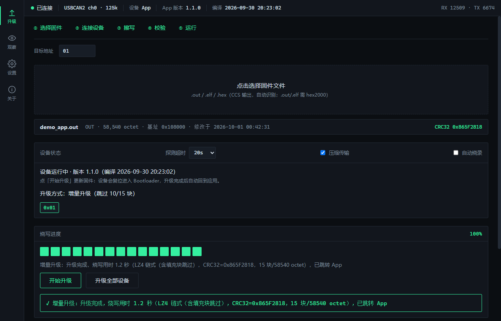
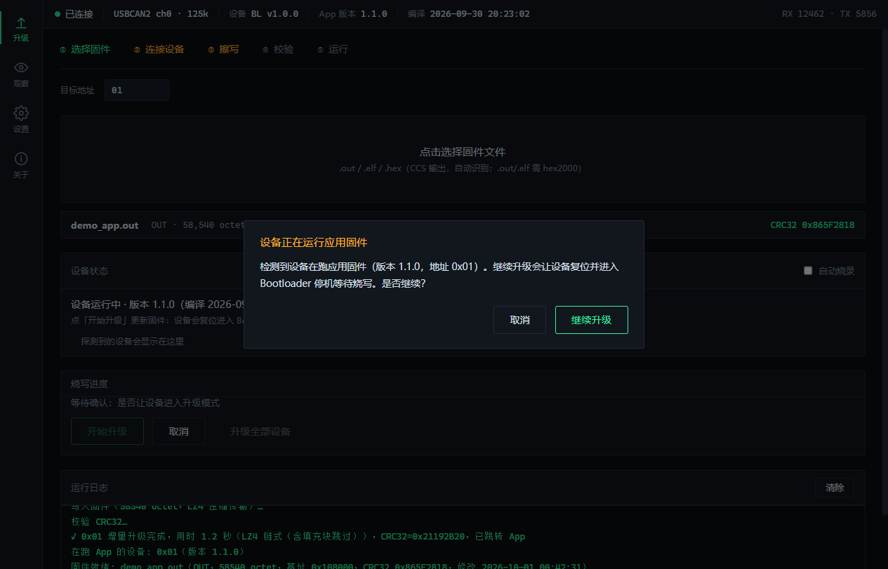
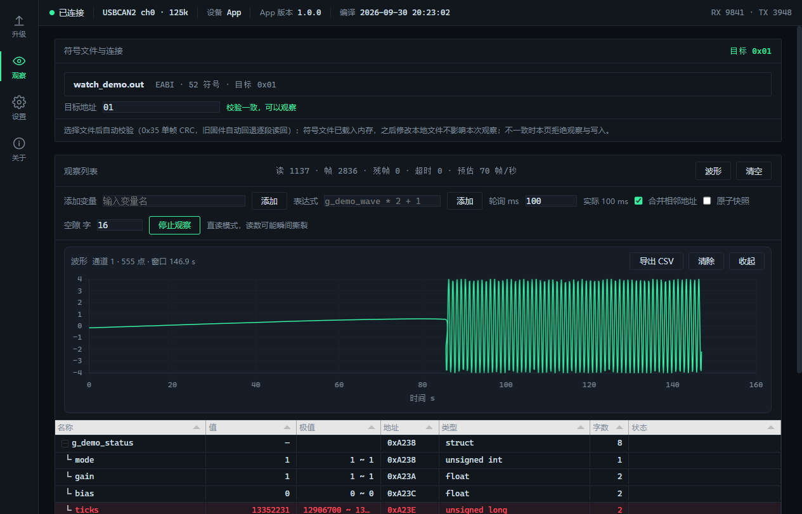
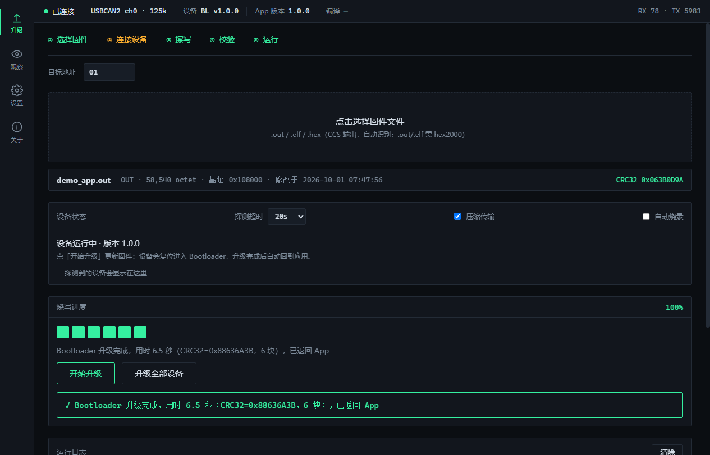
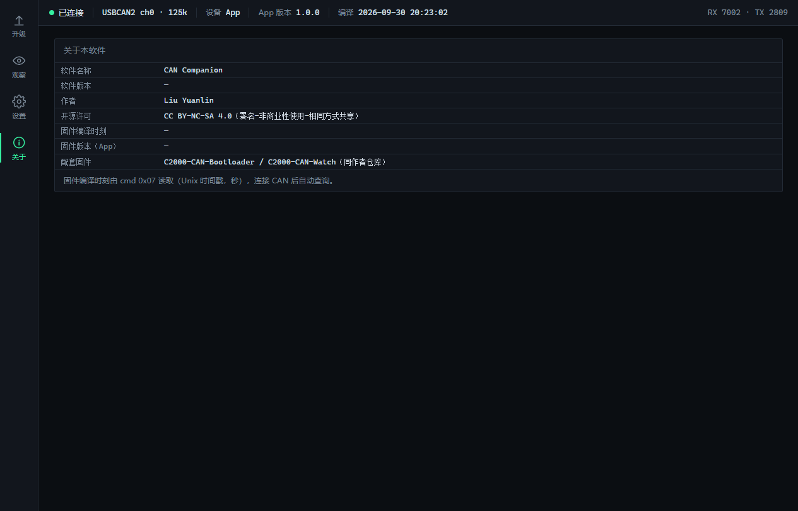

# CAN Companion

TI C2000 CAN 固件的桌面上位机：固件升级页 + 变量观察（WATCH）页。Python + pywebview，Windows 桌面运行，配合 [c2000-can-bootloader](https://github.com/MisakaMikoto128/c2000-can-bootloader) 与 [c2000-can-watch](https://github.com/MisakaMikoto128/c2000-can-watch) 两个演示固件开箱即用。


## 功能

| 功能 | 说明 |
|---|---|
| 固件升级 | 探测设备在哪一侧（App/Bootloader）→ 确认 → 擦写校验跳转，LZ4/LZ4 链式压缩传输 |
| 增量升级 | 按块比对设备 Flash 现存内容，只写差异块，失败自动转全量 |
| Bootloader 升级 | 内置 RAM 烧录代理镜像，经 ALOAD/ARUN 装载后由代理擦写 BL 区（配套 c2000-can-bootloader 的 ram_burner 工程） |
| 批量升级 | 广播发现总线上全部设备，按地址逐台升级 |
| 自动烧录 | 监视固件文件变化，编译产物一落盘即自动重载并升级（单机） |
| 变量观察 | 解析 CCS 输出的 ELF .out 符号（DWARF），结构体/数组/枚举展开，相邻地址合并读取 |
| 在线写入 | 观察表行内改值，写前强制 0x35 CRC 校验符号文件与板上固件一致 |
| 波形与导出 | 每通道环形缓冲波形 + CSV 导出 |
| 会话持久化 | 固件路径、观察清单、连接配置随启动恢复 |

## 界面

**固件升级**——设备状态、块级进度、增量/全量方式一目了然：



升级前确认，升级完成后设备自动回到应用：



**变量观察**——实时数值、极值统计、波形记录（图中波形记录了幅值写入前后的阶跃）：



**Bootloader 升级**——代理装载、接管确认、新 BL 就位全程留痕：



**关于**：



## 快速开始

1. **环境**（一次性，需网络）：双击 `setup_env.bat`，创建 .venv 并安装 pywebview / pyelftools。
2. **启动**：双击 `start_gui.bat`。
3. **硬件**：ZLG USBCAN2 适配器，125 kbps。`ControlCAN.dll` 按以下顺序查找：exe 旁 → 程序目录 → 仓库根目录 → `C:\ZLG\ControlCAN.dll`。
4. **体验**：
   - 升级：配合 `c2000-can-bootloader` 的 `demo_app.out`，选文件 → 开始升级；
   - 观察：配合 `c2000-can-watch` 的 `watch_demo.out`（仓库已带编译副本），观察页选文件 → 加变量 → 开始观察。

## 目录结构

```
C2000-CAN-Companion/
├── main.py / setup_env.bat / start_gui.bat
├── monitor_tui/          Python 包
│   ├── host_app.py       pywebview HostAPI：连接/升级/观察的后端入口
│   ├── canbus.py         ZLG USBCAN2 驱动（收发同线程 I/O 模型）
│   ├── watch.py          WATCH 引擎：DWARF 符号解析、轮询状态机、读写会话
│   ├── protocol.py       自有协议（dev 0x0C）编解码
│   ├── lz4.py            LZ4 独立块 + 链式字典压缩
│   ├── upgrade/          Bootloader 客户端、固件装载、探测、增量规划、订阅分发通道
│   │                     （ram_burner_blob.py = 内置 RAM 烧录代理镜像，随 BL 仓库 ram_burner 工程重建后同步再生成）
│   └── static_host/      前端（index.html / app.js / watch.js，Tabulator + Chart.js 本地内置）
├── tests/                五套离线测试（不依赖硬件，288 项断言）
└── demo/                 配套演示固件副本（供无硬件冒烟）
```

## 测试

```bat
.venv\Scripts\python.exe tests\offline_watch_test.py
.venv\Scripts\python.exe tests\offline_upgrade_test.py
.venv\Scripts\python.exe tests\offline_compress_test.py
.venv\Scripts\python.exe tests\offline_selective_test.py
.venv\Scripts\python.exe tests\offline_settings_test.py
```

全部离线运行（假通道驱动完整升级/观察状态机），不打开任何 CAN 设备。

## 配套仓库

- [c2000-can-bootloader](https://github.com/MisakaMikoto128/c2000-can-bootloader) —— C2000 CAN Bootloader + 演示应用
- [c2000-can-watch](https://github.com/MisakaMikoto128/c2000-can-watch) —— CAN 变量观察演示固件

## 许可

以 [CC BY-NC-SA 4.0](LICENSE)（署名—非商业性使用—相同方式共享 4.0）发布：可自由使用、修改与分发，**不得用于商业目的**；引用源码或思路时请注明作者（Liu Yuanlin）。
